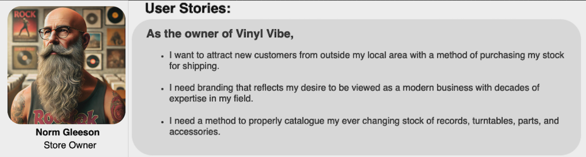
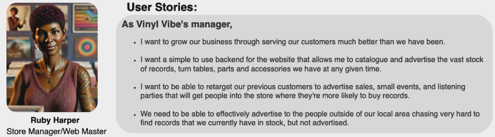
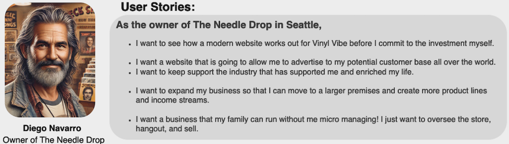

# Vinyl Vibe - T3A2-B


**Frontend Repo Link:** https://github.com/Vinyl-Vibe/vinyl-vibe-frontend

**Backend Repo Link:** https://github.com/Vinyl-Vibe/vinyl-vibe-backend

**Deployed Website Link** https://vinylvibe.live/

<br>

## Table of Contents

-   [App Functionality](#features-and-functionality)
    -   [Meets client needs](#how-it-meets-client-needs)


<br>

-   [API Endpoints](#api-endpoints)
    -   [Auth Routes](#auth-routes)
    -   [Cart Routes](#cart-routes)
    -   [Users Routes](#users-routes)
    -   [Orders Routes](#orders)
    -   [Products Routes](#products)

<br>

-   [Testing](#testing)
    -   [Manual (Dev & Prod)]()
    -   [Programmatic (Dev & Prod)]()

<br>

-   [Deployment](#deployment)
    -   [Client]()
    -   [Server (env var)]()
    -   [Database (local, prod)]()

<br>

-   [Maintainability & Scalability](#maintainability-and-scalability)
    -   [Project Directory]()

<br>

-   [Project Management (Trello)](#project-management)
    -   [Planning Methodology/intro]()
    -   [Team Members (Strength & Weaknesses for task assignments)](#team-members-strengths-weaknesses-and-task-assignments)
    -   [Trello breakdown - labels, difficulty level, git commit links)](#trello-breakdown)
    -   [Trello screenshots)](#)

<br>

-   [Changes & Updates to Plan (Part-A)](#changes-and-updates-from-part-a)

    -   [Link to Original Plan Document (Part-A)](/docs/Part-A.md)

---

<br>

## Features and Functionality

The Vinyl Vibe Website has been designed to be the ideal digital presence for the Bricks and mortar, cult status record store of the same name in Regional NSW.

It features:

    * Landing Page
    * Admin Dashboard

    * Products section, separated into the categories:
        - Vinyl
        - Turntables
        - Accessories
        - Merchandise

    * Customer Login page
    * Shopping Cart
    * Order History
    * Stripe integration for Payments

*** 
## How it meets Client Needs

We determined the needs of the clients by establishing User Stories for the 4 main users of the Vinyl Vibe Website. We looked at demographic, goals, motivations, and frustrations to come up with the following statements:


<details>
<summary><strong>User 1</strong></summary>

### User 1



### Reflection 1
Norm's business now has a website that new customers feel comfortable purchasing from. They have a safe method of payment with Stripe integration. The modern branding is simple and unobtrusive, with just a touch of colour that draws the eye to the logo. The UI/UX is efficient and intuitive. He can now display his stock for sale in an efficient manner that has helped to improve sales.


</details>
<br>

<details>
<summary><strong>User 2</strong></summary>


### User 2


### Reflection 2
Ruby has been extremely pleased with the Admin Dashboard. She can now track sales, orders, product lines, users, and abandoned carts. She can update the products for sale in a very straightforward way. More of the stock that was in the shop is now being advertised, which has led to increased sales, moving closer to her goal of growing the store to become a music destination for the world, rather than the best kept secret of only a few. The website has leant legitimacy to the business, so when previous customers are re-targeted for advertising, she knows that her conversion rate has improved. 

</details>

<br>

<details>
<summary><strong>User 3</strong></summary>

### User 3


### Reflection 3

Atticus is now able to keep up-to-date with what is in stock at Vinyl Vibe and can make regular orders from the convenience of his phone.  Now that there is an easy system to catalogue Norm's vast collection of hard to find Australian records, Atticus has been on a bit of a spending spree. Turns out Norm had many of the records that Atticus had been seeking for his collection for many years, sitting in milk crates out the back of his shop, unadvertised! Atticus has been able to expand his record collection quickly, with rare and hard to find records. He now regularly recommends Vinyl Vibe to his fellow audiophiles and music collectors. This has bought considerably more customers into the shop, which has meant a growth in sales and market share. 
</details>

<br>

<details>
<summary><strong>User 4</strong></summary>

### User 4


### Reflection 4

Diego has been extremely impressed with the Vinyl Vibe website. He no longer has to ring Norm at 3am (Seattle time) to see if he has particular records that his customers are looking for. He can just look on Norm's website. In an effort to improve their reciprocal business arrangement, Diego has now commissioned a website for his store, The Needle Drop, which will have all of the same functionality of the Vinyl Vibe site, but with his own branding on it. Now when he rings Norm, its just to reminisce about the good old days when they used to tour together as Roadies. 

</details>

<br>

*** 
## API Endpoints
This section provides detailed information about the available API endpoints, their usage, and expected responses.

<br>

### Auth Routes:

---


<br>
<br>

<details>
<summary><strong>Register a new user</strong></summary>

| FUNCTION | PATH | METHOD | AUTH REQUIRED | QUERY PARAMETERS |
|----------|------|--------|---------------|------------------|
| Register a new user | `/auth/register` | POST | null | null |

<br>

**Example Request Body**:
```json
{
  "email": "test101@example.com",
  "password": "password123"
}
```
**Example Success Response** (201 Created):
```json
{
  "token": "eyJhbGciOiJIUzI1NiIsInR5cCI6IkpXVCJ9....",
  "user": {
    "id": "6766a7f3ef7cd743418164f8",
    "email": "test101@example.com",
    "role": "user"
  }
}
```

<br>

**Error Responses**:

- 400 Bad request:

```json
{
  "status": "fail",
  "error": {
    "statusCode": 400,
    "status": "fail",
    "isOperational": true
  },
  "message": "User already exists",
  "stack": {STACK_DATA}
}
```
```json
{
  "status": "fail",
  "error": {
    "statusCode": 400,
    "status": "fail",
    "isOperational": true
  },
  "message": "Email and password are required",
  "stack": {STACK_DATA}
}
```
</details>


<details>
<summary><strong>User login</strong></summary>
<br>
<br>

---

<br>
<br>

| FUNCTION | PATH | METHOD | AUTH REQUIRED | QUERY PARAMETERS |
|----------|------|--------|----------------|------------------|
| User login | `/auth/login` | POST | JWT in header | null |

<br>

**Example Request Body**:
  ```json
  {
    "username": "damian@example",
    "password": "password123"
  }
  ```

<br>

**Example Success Response** (201 Created):
  ```json
{
  "token": "eyJhbGciOiJIUzI1NiIsInR5cCI6IkpXVCJ9..........",
  "user": {
    "id": "675be0befe6e8441a443e11b",
    "email": "damian@example.com",
    "role": "admin"
    }
}
  ```

<br>

**Error Responses**:
  
  - 400 Bad Request:

```json
{
  "status": "fail",
  "error": {
    "statusCode": 401,
    "status": "fail",
    "isOperational": true
  },
  "message": "Invalid credentials",
  "stack": {STACK_DATA}
}
```
</details>

<details>
<summary><strong>Forgot Password</strong></summary>
<br>
<br>

---

<br>
<br>

| FUNCTION | PATH | METHOD | AUTH REQUIRED | QUERY PARAMETERS |
|----------|------|--------|----------------|------------------|
| Request Password Reset Link | `/auth/forgot-password` | POST | JWT in header | email |


<br>

**Example Request Body**:
  ```json
{
  "email": "damian@example.com"
}
  ```
<br>

**Example Success Response**:
```json
{
    "status": "success",
    "message": "If an account exists with that email, a password reset link has been sent.",
}
```

<br>

**Example of Error Response**:
```json
{
  "status": "error",
  "error": {
    "statusCode": 500,
    "status": "error",
    "isOperational": true
  },
  "message": "Error updating user: Cannot read properties of undefined (reading 'role')",
  "stack": {STACK_DATA}
}
```
</details>

<details>
<summary><strong>Reset Password</strong></summary>
<br>
<br>

---

<br>
<br>

| FUNCTION | PATH | METHOD | AUTH REQUIRED | QUERY PARAMETERS |
|----------|------|--------|----------------|------------------|
| Request Password Reset Link | `/auth/reset-password` | POST | JWT in header | email |


<br>

**Example Request Body**:
  ```json
{
  "token": "reset_token_from_email",
  "newPassword": "newPassword123"
}
  ```
<br>

**Example Success Response**:
```json
{
    "status": "success",
    "message": "Password successfully reset",
    "token": "eyJhbGciOiJIUzI1NiIsInR5cCI6IkpXVCJ9.....",
    "user": {
        "id": "675be0befe6e8441a443e11b",
        "email": "damian@example.com",
        "role": "admin",
    }
}
```

<br>

**Example of Error Response**:
```json
{
  "status": "error",
  "error": {
    "statusCode": 400,
    "status": "error",
    "isOperational": true
  },
  "message": "Reset link has expired or is invalid. Please request a new password reset.",
  "stack": {STACK_DATA}
}
```
</details>


<details>
<summary><strong>Logout</strong></summary>
<br>
<br>

---

<br>
<br>

| FUNCTION | PATH | METHOD | AUTH REQUIRED | QUERY PARAMETERS |
|----------|------|--------|----------------|------------------|
| User logout| `/auth/logout` | POST | JWT in header | null |


<br>

**Example Success Response** (200 Created):
  ```json
{
  "message": "Logged out successfully"
}
  ```
</details>

<details>
<summary><strong>Auth Refresh</strong></summary>

<br>
<br>

---

<br>
<br>

| FUNCTION | PATH | METHOD | AUTH REQUIRED | QUERY PARAMETERS |
|----------|------|--------|----------------|------------------|
| Refresh Token| `/auth/refresh` | POST | JWT in header | null |


<br>

**Example Success Response** (200 Created):
  ```json
{
    "token": "eyJhbGciOiJIUzI1NiIsInR5cCI6IkpGM3Ed.....",
    "user": {
        "id": "675be0befe6e8441a443e11b",
        "email": "damian@example.com",
        "role": "admin",
    },
}
  ```
</details>

<details>
<summary><strong>Get current user account</strong></summary>
<br>

---

<br>
<br>

| FUNCTION | PATH | METHOD | AUTH REQUIRED | QUERY PARAMETERS |
|----------|------|--------|----------------|------------------|
| Get current users account | `/auth/me` | POST | JWT in header | null |

**Example Request Body**

Bearer Token inheritted 

<br>

**Example Success Response** (201 Created):
  ```json
{
  "user": {
    "id": "675be0befe6e8441a443e11b",
    "email": "damian@example.com",
    "role": "admin",
    "profile": {
      "address": {},
      "firstName": "Damian",
      "lastName": "Petrov"
    },
    "socialLogins": [],
    "createdAt": "2024-12-13T07:22:38.291Z",
    "updatedAt": "2024-12-19T12:50:48.145Z"
  }
}
  ```
  </details>

***

### Cart Routes

---

<details>
<summary><strong>Get current user's cart</strong></summary>

<br>
<br>

| FUNCTION | PATH | METHOD | AUTH REQUIRED | QUERY PARAMETERS |
|----------|------|--------|----------------|------------------|
| Get current user's cart | `/carts/me` | GET | JWT in header | null |

**Example of successful response**
```json
{
  "status": "success",
  "cart": {
    "_id": "6766921332d3cebf4d98e813",
    "user": {
      "id": "675be0befe6e8441a443e11b",
      "email": "damian@example.com"
    },
    "products": [
      {
        "product": {
          "id": "675ad9b77d85749f98a8568c",
          "name": "Galactaphonic",
          "price": 39.99,
          "type": "vinyl",
          "thumbnail": ""
        },
        "quantity": 1
      }
    ],
    "createdAt": "2024-12-21T10:01:55.498Z",
    "updatedAt": "2024-12-21T10:01:55.498Z"
  }
}
```
</details>

<details>
<summary><strong>Get All user's carts</strong></summary>
<br>
<br>

---


<br>
<br>

| FUNCTION | PATH | METHOD | AUTH REQUIRED | QUERY PARAMETERS |
|----------|------|--------|----------------|------------------|
| Get all user's carts | `/carts` | GET | JWT in header | ADMIN |

<br>

**Example Success Response - 200 OK**

```json
{
  "status": "success",
  "carts": [
    {
      "_id": "6765647589fd56601033b9a4",
      "user": {
        "id": "676529c020b6a63cfbad0c6d",
        "email": "niaali@example.com"
      },
      "products": [
        {
          "product": {
            "id": "675aed497d85749f98a856c3",
            "name": "Audio-Technica AT618a Disc Stabilizer",
            "price": 59,
            "type": "accessory",
            "thumbnail": ""
          },
          "quantity": 2
        }
      ],
      "createdAt": "2024-12-20T12:35:01.581Z",
      "updatedAt": "2024-12-20T12:35:01.581Z"
    },
    {
      "_id": "676564a389fd56601033b9b3",
      "user": {
        "id": "67652a1920b6a63cfbad0ca3",
        "email": "barbaragarcia@example.com"
      },
      "products": [
        {
          "product": {
            "id": "676127e8303f21258a4e6685",
            "name": "Bottle Openner",
            "price": 5,
            "type": "merch"
          },
          "quantity": 1
        }
      ],
      "createdAt": "2024-12-20T12:35:47.977Z",
      "updatedAt": "2024-12-20T12:35:47.977Z"
    }
  ]
}
```
</details>

<details>
<summary><strong>Add an item to current users cart</strong></summary>

<br>
<br>

---


<br>
<br>

| FUNCTION | PATH | METHOD | AUTH REQUIRED | QUERY PARAMETERS |
|----------|------|--------|----------------|------------------|
| Add item to current users cart | `/carts` | POST | JWT in header | `productId`, `quantity` |

<br>

**Example Request Body**
```json
  {
      "productId": "675af09e7d85749f98a856cd",
      "quantity": 1
  }
```

**Example Success Response - 200 OK**

```json
{
  "status": "success",
  "cart": {
    "_id": "6766921332d3cebf4d98e813",
    "user": {
      "id": "675be0befe6e8441a443e11b",
      "email": "damian@example.com"
    },
    "products": [
      {
        "product": {
          "id": "675af09e7d85749f98a856cd",
          "name": "Ivy and the Big Apples",
          "price": 39.99,
          "type": "vinyl",
          "thumbnail": ""
        },
        "quantity": 1
      }
    ],
    "createdAt": "2024-12-21T10:01:55.498Z",
    "updatedAt": "2024-12-21T12:31:01.163Z"
  }
}
```
</details>

<details>
<summary><strong>Update Item Quantity</strong></summary>
<br>
<br>

---


<br>
<br>

| FUNCTION | PATH | METHOD | AUTH REQUIRED | QUERY PARAMETERS |
|----------|------|--------|----------------|------------------|
| Update item quantity in current user's cart | `/carts/<productId>` | POST | JWT in header | `quantity` |

<br>

**Example Request Body**
```json
  {
      "quantity": 2
  }
```

<br>

**Example Success Response**

```json
{
  "status": "success",
  "cart": {
    "_id": "6766921332d3cebf4d98e813",
    "user": {
      "id": "675be0befe6e8441a443e11b",
      "email": "damian@example.com"
    },
    "products": [
      {
        "product": {
          "id": "675ad9b77d85749f98a8568c",
          "name": "Galactaphonic",
          "price": 39.99,
          "type": "vinyl",
          "thumbnail": ""
        },
        "quantity": 2
      },
    ],
    "createdAt": "2024-12-21T10:01:55.498Z",
    "updatedAt": "2024-12-21T14:22:04.886Z"
  }
}
```
</details>

<details>
<summary><strong>Remove Item from Cart</strong></summary>
<br>
<br>

---


<br>
<br>

| FUNCTION | PATH | METHOD | AUTH REQUIRED | QUERY PARAMETERS |
|----------|------|--------|----------------|------------------|
| Remove item from current user's cart | `/carts/<productId>` | DELETE | JWT in header | `productId` |

**Example Request URL**

```http://{{base_url}}/carts/675ad9b77d85749f98a8568c```
<br>

**Example Success Response**

```json
{
  "status": "success",
  "message": "Product removed from cart",
  "cart": {
    "_id": "6766921332d3cebf4d98e813",
    "user": {
      "id": "675be0befe6e8441a443e11b",
      "email": "damian@example.com"
    },
    "products": [
      {
        "product": {
          "id": "675af09e7d85749f98a856cd",
          "name": "Ivy and the Big Apples",
          "price": 39.99,
          "type": "vinyl",
          "thumbnail": ""
        },
        "quantity": 1
      }
    ],
    "createdAt": "2024-12-21T10:01:55.498Z",
    "updatedAt": "2024-12-21T14:24:23.408Z"
  }
}
```
</details>
<br>

***

### Users Routes

***


<details>
<summary><strong>Get All Users</strong></summary>
<br>
<br>

---

<br>
<br>

| FUNCTION | PATH | METHOD | AUTH REQUIRED | QUERY PARAMETERS |
|----------|------|--------|----------------|------------------|
| Get all users | `/users` | GET | JWT in header | null |


**Example Success Response**

```json
  {
    "_id": "676529fd20b6a63cfbad0c9d",
    "email": "aaliyahsuleiman@example.com",
    "role": "user",
    "createdAt": "2024-12-20T08:25:33.187Z",
    "updatedAt": "2024-12-20T08:25:33.187Z"
  },
  {
    "_id": "67652882305df4e667237ab7",
    "email": "amanda.brown@yahoo.com",
    "role": "user",
    "profile": {
      "firstName": "Amanda",
      "lastName": "Brown"
    },
    "createdAt": "2024-12-20T08:19:14.522Z",
    "updatedAt": "2024-12-20T08:19:44.208Z"
  },
  {
    "_id": "67652626a3f919022a023ebf",
    "email": "amanda.moore@gmail.com",
    "role": "user",
    "createdAt": "2024-12-20T08:09:10.870Z",
    "updatedAt": "2024-12-20T08:09:10.870Z"
  },
```
</details>

<details>
<summary><strong>Get User by userId</strong></summary>
<br>
<br>

---


<br>
<br>

| FUNCTION | PATH | METHOD | AUTH REQUIRED | QUERY PARAMETERS |
|----------|------|--------|----------------|------------------|
| Get user by Id | `/user/<userId>` | GET | JWT in header | null |


<br>

**Example Request URL**

```http://{{base_url}}/users/67652626a3f919022a023ebf```


**Example Success Response**

```json
{
  "_id": "67652626a3f919022a023ebf",
  "email": "amanda.moore@gmail.com",
  "role": "user",
  "socialLogins": [],
  "createdAt": "2024-12-20T08:09:10.870Z",
  "updatedAt": "2024-12-20T08:09:10.870Z"
}
```
</details>

<details>
<summary><strong>Update UserId</strong></summary>
<br>
<br>

---


<br>
<br>

| FUNCTION | PATH | METHOD | AUTH REQUIRED | QUERY PARAMETERS |
|----------|------|--------|----------------|------------------|
| Update user ID | `/user/<userId>` | PATCH | JWT in header | email, role |


<br>

**Example Body Request**

```json
{
  "role": "admin"
}
```


**Example Success Response**

```json
{
  "_id": "67652882305df4e667237ab7",
  "email": "amanda.brown@yahoo.com",
  "role": "admin",
  "profile": {
    "firstName": "Amanda",
    "lastName": "Brown"
  },
  "socialLogins": [],
  "createdAt": "2024-12-20T08:19:14.522Z",
  "updatedAt": "2024-12-21T15:05:59.644Z"
}
```
</details>

<details>
<summary><strong>Delete User</strong></summary>
<br>
<br>

---


<br>
<br>

| FUNCTION | PATH | METHOD | AUTH REQUIRED | QUERY PARAMETERS |
|----------|------|--------|----------------|------------------|
| Delete user by ID | `/user/<userId>` | DELETE | JWT in header | userId |


<br>

**Example Request URL**

```http://{{base_url}}/users/67652626a3f919022a023ebf```


**Example Success Response**

```204 indicates successful deletion with no content returned```
</details>

<details>
<summary><strong>Get User Profile</strong></summary>
<br>
<br>

---


<br>
<br>

| FUNCTION | PATH | METHOD | AUTH REQUIRED | QUERY PARAMETERS |
|----------|------|--------|----------------|------------------|
| Get current user's profile | `/user/profile` | GET | JWT in header | profile |


<br>


**Example Success Response**

```json
{
  "_id": "675be0befe6e8441a443e11b",
  "email": "damian@example.com",
  "role": "admin",
  "profile": {
    "firstName": "Damian",
    "lastName": "Petrov"
  },
  "socialLogins": [],
  "createdAt": "2024-12-13T07:22:38.291Z",
  "updatedAt": "2024-12-21T15:12:53.103Z"
}
```
</details>

<details>
<summary><strong>Update User Profile</strong></summary>
<br>
<br>

---


<br>
<br>

| FUNCTION | PATH | METHOD | AUTH REQUIRED | QUERY PARAMETERS |
|----------|------|--------|----------------|------------------|
| Update current user's profile | `/user/profile` | PATCH | JWT in header | profile |


<br>

**Example Request Body**

```json
{
  "firstName": "NewName"
}
```


**Example Success Response**

```json
{
  "_id": "675be0befe6e8441a443e11b",
  "email": "damian@example.com",
  "role": "admin",
  "profile": {
    "firstName": "NewName",
    "lastName": "Petrov"
  },
  "socialLogins": [],
  "createdAt": "2024-12-13T07:22:38.291Z",
  "updatedAt": "2024-12-21T15:12:53.103Z"
}
```
</details>


<br>

***


## Orders

<details>
<summary><strong>Get All Orders</strong></summary>
<br>
<br>

---


<br>
<br>

| FUNCTION | PATH | METHOD | AUTH REQUIRED | QUERY PARAMETERS |
|----------|------|--------|----------------|------------------|
| Get all orders | `/orders` | GET | JWT in header | null |


<br>

**Example Success Response**

```json
{
  "status": "success",
  "orders": [
    {
      "_id": "6762d9d5a2c5237a0d528c76",
      "userId": {
        "_id": "675be0befe6e8441a443e11b",
        "email": "damian@example.com",
        "profile": {
          "firstName": "Damian",
          "lastName": "Petrov",
          "address": {
            "street": "123 Example Street",
            "city": "Melbourne",
            "state": "Victoria",
            "postalCode": "3000",
            "country": "Australia"
          },
          "phoneNumber": "+61 400 123 456"
        }
      },
      "products": [
        {
          "productId": {
            "_id": "675ad9b77d85749f98a85685",
            "name": "Abbey Road",
            "price": 39.99,
            "type": "vinyl",
            "thumbnail": ""
          },
          "quantity": 8,
          "price": 39.99,
          "_id": "6762d9d5a2c5237a0d528c77"
        },
        {
          "productId": {
            "_id": "675ad9b77d85749f98a85686",
            "name": "Thriller",
            "price": 39.99,
            "type": "vinyl",
            "thumbnail": ""
          },
          "quantity": 2,
          "price": 39.99,
          "_id": "6762d9d5a2c5237a0d528c78"
        }
      ],
      "total": 399.9,
      "status": "shipped",
      "createdAt": "2024-12-18T14:19:01.879Z",
      "updatedAt": "2024-12-18T14:19:01.879Z",
      "shippingAddress": {
        "street": "123 Example Street",
        "city": "Melbourne",
        "state": "Victoria",
        "postalCode": "3000",
        "country": "Australia"
      }
    },
  ]
}
```
</details>

<details>
<summary><strong>Get All Orders Paginated</strong></summary>
<br>
<br>

---


<br>
<br>

| FUNCTION | PATH | METHOD | AUTH REQUIRED | QUERY PARAMETERS |
|----------|------|--------|----------------|------------------|
| Get all orders paginated | `/orders?page=<page>&limit=<limit>` | GET | JWT in header | page, limit |


<br>

**Example Request Body**

**Params**
| NAME | VALUE |
|------|------|
| page | 1 |
| limit | 20 |

<br>


**Example Success Response**
NB: shortened for brevity

```json
{
  "status": "success",
  "orders": [
    {
      "_id": "6762d9d5a2c5237a0d528c76",
      "userId": {
        "_id": "675be0befe6e8441a443e11b",
        "email": "damian@example.com",
        "profile": {
          "firstName": "Damian",
          "lastName": "Petrov",
          "address": {
            "street": "123 Example Street",
            "city": "Melbourne",
            "state": "Victoria",
            "postalCode": "3000",
            "country": "Australia"
          },
          "phoneNumber": "+61 400 123 456"
        }
      },
      "products": [
        {
          "productId": {
            "_id": "675ad9b77d85749f98a85685",
            "name": "Abbey Road",
            "price": 39.99,
            "type": "vinyl",
            "thumbnail": ""
          },
          "quantity": 8,
          "price": 39.99,
          "_id": "6762d9d5a2c5237a0d528c77"
        },
        {
          "productId": {
            "_id": "675ad9b77d85749f98a85686",
            "name": "Thriller",
            "price": 39.99,
            "type": "vinyl",
            "thumbnail": ""
          },
          "quantity": 2,
          "price": 39.99,
          "_id": "6762d9d5a2c5237a0d528c78"
        }
      ],
      "total": 399.9,
      "status": "shipped",
      "createdAt": "2024-12-18T14:19:01.879Z",
      "updatedAt": "2024-12-18T14:19:01.879Z",
      "shippingAddress": {
        "street": "123 Example Street",
        "city": "Melbourne",
        "state": "Victoria",
        "postalCode": "3000",
        "country": "Australia"
      }
    },
  ]
}...
```
</details>

<details>
<summary><strong>Get My Orders</strong></summary>
<br>
<br>

---


<br>
<br>

| FUNCTION | PATH | METHOD | AUTH REQUIRED | QUERY PARAMETERS |
|----------|------|--------|----------------|------------------|
| Get all my orders | `/orders/me` | GET | JWT in header | null |


<br>

**Example Success Response**
NB: shortened for brevity
```json
{
  "status": "success",
  "orders": [
    {
      "_id": "6762d9d5a2c5237a0d528c76",
      "userId": {
        "_id": "675be0befe6e8441a443e11b",
        "email": "damian@example.com",
        "profile": {
          "firstName": "Damian",
          "lastName": "Petrov",
          "address": {
            "street": "123 Example Street",
            "city": "Melbourne",
            "state": "Victoria",
            "postalCode": "3000",
            "country": "Australia"
          },
          "phoneNumber": "+61 400 123 456"
        }
      },
      "products": [
        {
          "productId": {
            "_id": "675ad9b77d85749f98a85685",
            "name": "Abbey Road",
            "price": 39.99,
            "type": "vinyl",
            "thumbnail": ""
          },
          "quantity": 8,
          "price": 39.99,
          "_id": "6762d9d5a2c5237a0d528c77"
        },
        {
          "productId": {
            "_id": "675ad9b77d85749f98a85686",
            "name": "Thriller",
            "price": 39.99,
            "type": "vinyl",
            "thumbnail": ""
          },
          "quantity": 2,
          "price": 39.99,
          "_id": "6762d9d5a2c5237a0d528c78"
        }
      ],
      "total": 399.9,
      "status": "shipped",
      "createdAt": "2024-12-18T14:19:01.879Z",
      "updatedAt": "2024-12-18T14:19:01.879Z",
      "shippingAddress": {
        "street": "123 Example Street",
        "city": "Melbourne",
        "state": "Victoria",
        "postalCode": "3000",
        "country": "Australia"
      }
    },
  ]
}...
```
</details>

<details>
<summary><strong>Create Stripe Checkout with Order</strong></summary>
<br>
<br>

---


<br>
<br>

| FUNCTION | PATH | METHOD | AUTH REQUIRED | QUERY PARAMETERS |
|----------|------|--------|----------------|------------------|
| Create Stripe Checkout with Order | `/orders` | POST | JWT in header | null |


<br>

**Example Success Response**

```json
{
  "success": true,
  "message": "Order created successfully",
  "order": {
    "_id": "6767496515a2cfb23a452e50",
    "userId": {
      "_id": "675be0befe6e8441a443e11b",
      "email": "damian@example.com",
      "profile": {
        "address": {
          "street": "123 Example Street",
          "city": "Melbourne",
          "state": "Victoria",
          "postalCode": "3000",
          "country": "Australia"
        },
        "firstName": "Damian",
        "lastName": "Petrov",
        "phoneNumber": "+61 400 123 456"
      },
      "socialLogins": []
    },
    "products": [
      {
        "productId": {
          "_id": "675ad9b77d85749f98a85685",
          "name": "Abbey Road",
          "price": 39.99,
          "description": "The Beatles' final studio masterpiece, featuring iconic harmonies, innovative production, and timeless classics that showcase their creative peak.",
          "images": [],
          "thumbnail": ""
        },
        "quantity": 8,
        "price": 39.99,
        "_id": "6767496515a2cfb23a452e51"
      },
      {
        "productId": {
          "_id": "675ad9b77d85749f98a85686",
          "name": "Thriller",
          "price": 39.99,
          "description": "The best-selling album of all time, combining infectious pop, rock, and funk with groundbreaking production and Michael Jackson's unparalleled artistry.",
          "images": [],
          "thumbnail": ""
        },
        "quantity": 2,
        "price": 39.99,
        "_id": "6767496515a2cfb23a452e52"
      }
    ],
    "total": 399.9,
    "status": "pending",
    "createdAt": "2024-12-21T23:04:05.137Z",
    "updatedAt": "2024-12-21T23:04:05.137Z"
  },
  "checkoutUrl": {CHECKOUT_URL}
}
```
</details>

<details>
<summary><strong>Create New Order</strong></summary>
<br>
<br>

---


<br>
<br>

| FUNCTION | PATH | METHOD | AUTH REQUIRED | QUERY PARAMETERS |
|----------|------|--------|----------------|------------------|
| Create new Order | `/orders` | POST | JWT in header | null |


<br>

**Example Success Response**

```json
{
  "success": true,
  "message": "Order created successfully",
  "order": {
    "shippingAddress": {
      "street": "123 Ready street",
      "suburb": "Arundel",
      "postcode": "4214",
      "state": "Queensland",
      "country": "Australia"
    },
    "_id": "67674a0215a2cfb23a452e5b",
    "userId": {
      "_id": "675be0befe6e8441a443e11b",
      "email": "damian@example.com",
      "profile": {
        "address": {
          "street": "123 Example Street",
          "city": "Melbourne",
          "state": "Victoria",
          "postalCode": "3000",
          "country": "Australia"
        },
        "firstName": "Damian",
        "lastName": "Petrov",
        "phoneNumber": "+61 400 123 456"
      },
      "socialLogins": []
    },
    "products": [
      {
        "productId": {
          "_id": "675ad9b77d85749f98a85689",
          "name": "Coughing Up a Storm",
          "price": 39.99,
          "description": "A fast, sarcastic, and rebellious debut album that established Frenzal Rhomb as one of Australia's quintessential punk rock bands.",
          "images": [],
          "thumbnail": ""
        },
        "quantity": 2,
        "price": 39.99,
        "_id": "67674a0215a2cfb23a452e5c"
      }
    ],
    "total": 79.98,
    "status": "pending",
    "createdAt": "2024-12-21T23:06:42.015Z",
    "updatedAt": "2024-12-21T23:06:42.015Z"
  },
  "checkoutUrl": {CHECKOUT_URL}
}
```
</details>

<details>
<summary><strong>Update Order</strong></summary>
<br>
<br>

---


<br>
<br>

| FUNCTION | PATH | METHOD | AUTH REQUIRED | QUERY PARAMETERS |
|----------|------|--------|----------------|------------------|
| Update Order| `/orders/<order number>` | PATCH | JWT in header | status |


<br>

**Example Request Body**:

```json
{
    "status": "shipped"
}
```

<br>

**Example Success Response**

```json
{
  "success": true,
  "message": "Order updated successfully",
  "order": {
    "shippingAddress": {
      "street": "123 Ready street",
      "suburb": "Arundel",
      "postcode": "4214",
      "state": "Queensland",
      "country": "Australia"
    },
    "_id": "67674a0215a2cfb23a452e5b",
    "userId": {
      "_id": "675be0befe6e8441a443e11b",
      "email": "damian@example.com",
      "socialLogins": []
    },
    "products": [
      {
        "productId": {
          "_id": "675ad9b77d85749f98a85689",
          "name": "Coughing Up a Storm",
          "price": 39.99
        },
        "quantity": 2,
        "price": 39.99,
        "_id": "67674a0215a2cfb23a452e5c"
      }
    ],
    "total": 79.98,
    "status": "shipped",
    "createdAt": "2024-12-21T23:06:42.015Z",
    "updatedAt": "2024-12-21T23:10:50.956Z"
  }
}
```
</details>

<details>
<summary><strong>Delete and Order by Id</strong></summary>
<br>
<br>

---


<br>
<br>

| FUNCTION | PATH | METHOD | AUTH REQUIRED | QUERY PARAMETERS |
|----------|------|--------|----------------|------------------|
| Delete an Order by ID | `/orders/<order number>` | DELETE | JWT in header | status |


<br>

**Example Success Response**

```json
{
  "success": true,
  "message": "Order deleted successfully"
}
```
**Example Error Response**

```json
{
  "status": "fail",
  "error": {
    "statusCode": 404,
    "status": "fail",
    "isOperational": true
  },
  "message": "Order not found",
  "stack": {STACK_DATA}
}
```
</details>

<details>
<summary><strong>Get and Order by Id</strong></summary>
<br>
<br>

---


<br>
<br>

| FUNCTION | PATH | METHOD | AUTH REQUIRED | QUERY PARAMETERS |
|----------|------|--------|----------------|------------------|
| Get an Order by ID | `/orders/<userId>` | GET | JWT in header | status |


<br>


**Example Successful Response**
NB: Shortened for brevity
```json
{
  "success": true,
  "orders": [
    {
      "_id": "67650208ea44fda84d617649",
      "userId": {
        "_id": "6764223aea44fda84d617474",
        "email": "bradx32@hotmail.com",
        "profile": {
          "firstName": "Brad",
          "lastName": "Richmond",
          "address": {
            "street": "123 Example Street",
            "city": "Melbourne",
            "state": "Victoria",
            "postalCode": "3000",
            "country": "Australia"
          },
          "phoneNumber": "+61 400 123 456"
        }
      },
      "products": [
        {
          "productId": {
            "_id": "675ad9b77d85749f98a8568c",
            "name": "Galactaphonic",
            "price": 39.99,
            "type": "vinyl",
            "thumbnail": ""
          },
          "quantity": 1,
          "price": 39.99,
          "_id": "67650208ea44fda84d61764a"
        },
        {
          "productId": {
            "_id": "675aeba67d85749f98a856ba",
            "name": "Technics SL-1200G",
            "price": 3999,
            "type": "turntable",
            "thumbnail": ""
          },
          "quantity": 1,
          "price": 3999,
          "_id": "67650208ea44fda84d61764b"
        }
      ],
      "total": 4038.99,
      "status": "payment received",
      "createdAt": "2024-12-20T05:35:04.430Z",
      "updatedAt": "2024-12-20T08:35:09.585Z",
      "shippingAddress": {
        "street": "123 Example Street",
        "city": "Melbourne",
        "state": "Victoria",
        "postalCode": "3000",
        "country": "Australia"
      }
    },
    {
      "_id": "67651fe77770167a05c61ed5",
      "userId": {
        "_id": "6764223aea44fda84d617474",
        "email": "bradx32@hotmail.com",
        "profile": {
          "firstName": "Brad",
          "lastName": "Richmond",
          "address": {
            "street": "123 Example Street",
            "city": "Melbourne",
            "state": "Victoria",
            "postalCode": "3000",
            "country": "Australia"
          },
          "phoneNumber": "+61 400 123 456"
        }
      },
      "products": [
        {
          "productId": {
            "_id": "675ad9b77d85749f98a8568c",
            "name": "Galactaphonic",
            "price": 39.99,
            "type": "vinyl",
            "thumbnail": ""
          },
          "quantity": 1,
          "price": 39.99,
          "_id": "67651fe77770167a05c61ed6"
        },
        {
          "productId": {
            "_id": "675aeba67d85749f98a856ba",
            "name": "Technics SL-1200G",
            "price": 3999,
            "type": "turntable",
            "thumbnail": ""
          },
          "quantity": 1,
          "price": 3999,
          "_id": "67651fe77770167a05c61ed7"
        },
        {
          "productId": {
            "_id": "675ae2cd7d85749f98a8568f",
            "name": "All Eyez on Me",
            "price": 39.99,
            "type": "vinyl",
            "thumbnail": ""
          },
          "quantity": 2,
          "price": 39.99,
          "_id": "67651fe77770167a05c61ed8"
        }
      ],
      "total": 4118.97,
      "status": "pending",
      "createdAt": "2024-12-20T07:42:31.493Z",
      "updatedAt": "2024-12-20T07:42:31.493Z",
      "shippingAddress": {
        "street": "123 Example Street",
        "city": "Melbourne",
        "state": "Victoria",
        "postalCode": "3000",
        "country": "Australia"
      }
    }
  ]
}...
```
</details>

<details>
<summary><strong>Get Order by Status</strong></summary>
<br>
<br>

---


<br>
<br>

| FUNCTION | PATH | METHOD | AUTH REQUIRED | QUERY PARAMETERS |
|----------|------|--------|----------------|------------------|
| Get orders by status | `/orders?status=<status>` | GET | JWT in header | status |


<br>

**Example Request Body**

**Params**
| NAME | VALUE |
|------|------|
| status | pending |

<br>


**Example Success Response**
NB: shortened for brevity

```json
{
  "status": "success",
  "orders": [
    {
      "_id": "6764ff3aea44fda84d61759d",
      "userId": {
        "_id": "6764ff07ea44fda84d617575",
        "email": "reecewdoyle@gmail.com",
        "profile": {
          "firstName": "Reece",
          "lastName": "Doyle",
          "address": {
            "street": "123 Example Street",
            "city": "Melbourne",
            "state": "Victoria",
            "postalCode": "3000",
            "country": "Australia"
          },
          "phoneNumber": "+61 400 123 456"
        }
      },
      "products": [
        {
          "productId": {
            "_id": "675ae2cd7d85749f98a85690",
            "name": "Ready to Die",
            "price": 39.99,
            "type": "vinyl",
            "thumbnail": ""
          },
          "quantity": 1,
          "price": 39.99,
          "_id": "6764ff3aea44fda84d61759e"
        },
        {
          "productId": {
            "_id": "675ae2cd7d85749f98a8568f",
            "name": "All Eyez on Me",
            "price": 39.99,
            "type": "vinyl",
            "thumbnail": ""
          },
          "quantity": 1,
          "price": 39.99,
          "_id": "6764ff3aea44fda84d61759f"
        }
      ],
      "total": 79.98,
      "status": "pending",
      "createdAt": "2024-12-20T05:23:06.498Z",
      "updatedAt": "2024-12-20T05:23:06.498Z",
      "shippingAddress": {
        "street": "123 Example Street",
        "city": "Melbourne",
        "state": "Victoria",
        "postalCode": "3000",
        "country": "Australia"
      }
    },
    {
      "_id": "67650030ea44fda84d6175c0",
      "userId": {
        "_id": "6764ff07ea44fda84d617575",
        "email": "reecewdoyle@gmail.com",
        "profile": {
          "firstName": "Reece",
          "lastName": "Doyle",
          "address": {
            "street": "123 Example Street",
            "city": "Melbourne",
            "state": "Victoria",
            "postalCode": "3000",
            "country": "Australia"
          },
          "phoneNumber": "+61 400 123 456"
        }
      },
      "products": [
        {
          "productId": {
            "_id": "675ae2cd7d85749f98a85690",
            "name": "Ready to Die",
            "price": 39.99,
            "type": "vinyl",
            "thumbnail": ""
          },
          "quantity": 1,
          "price": 39.99,
          "_id": "67650030ea44fda84d6175c1"
        },
        {
          "productId": {
            "_id": "675ae2cd7d85749f98a8568f",
            "name": "All Eyez on Me",
            "price": 39.99,
            "type": "vinyl",
            "thumbnail": ""
          },
          "quantity": 1,
          "price": 39.99,
          "_id": "67650030ea44fda84d6175c2"
        }
      ],
      "total": 79.98,
      "status": "pending",
      "createdAt": "2024-12-20T05:27:12.143Z",
      "updatedAt": "2024-12-20T05:27:12.143Z",
      "shippingAddress": {
        "street": "123 Example Street",
        "city": "Melbourne",
        "state": "Victoria",
        "postalCode": "3000",
        "country": "Australia"
      }
    },
  ]
}...
```
</details>

<details>
<summary><strong>Get Orders by Date Range</strong></summary>
<br>
<br>

---


<br>
<br>

| FUNCTION | PATH | METHOD | AUTH REQUIRED | QUERY PARAMETERS |
|----------|------|--------|----------------|------------------|
| Get orders by date range | `/orders?start-date=<start-date>&end-date=<end-date>` | GET | JWT in header | status |


<br>

**Example Request Body**

**Params**
| NAME | VALUE |
|------|------|
| start-date | 2024-01-01 |
| end-date | 2024-12-31 |

<br>


**Example Success Response**
NB: shortened for brevity

```json
{
  "status": "success",
  "orders": [
    {
      "_id": "6762d9d5a2c5237a0d528c76",
      "userId": {
        "_id": "675be0befe6e8441a443e11b",
        "email": "damian@example.com",
        "profile": {
          "firstName": "Damian",
          "lastName": "Petrov",
          "address": {
            "street": "123 Example Street",
            "city": "Melbourne",
            "state": "Victoria",
            "postalCode": "3000",
            "country": "Australia"
          },
          "phoneNumber": "+61 400 123 456"
        }
      },
      "products": [
        {
          "productId": {
            "_id": "675ad9b77d85749f98a85685",
            "name": "Abbey Road",
            "price": 39.99,
            "type": "vinyl",
            "thumbnail": ""
          },
          "quantity": 8,
          "price": 39.99,
          "_id": "6762d9d5a2c5237a0d528c77"
        },
        {
          "productId": {
            "_id": "675ad9b77d85749f98a85686",
            "name": "Thriller",
            "price": 39.99,
            "type": "vinyl",
            "thumbnail": ""
          },
          "quantity": 2,
          "price": 39.99,
          "_id": "6762d9d5a2c5237a0d528c78"
        }
      ],
      "total": 399.9,
      "status": "shipped",
      "createdAt": "2024-12-18T14:19:01.879Z",
      "updatedAt": "2024-12-18T14:19:01.879Z",
      "shippingAddress": {
        "street": "123 Example Street",
        "city": "Melbourne",
        "state": "Victoria",
        "postalCode": "3000",
        "country": "Australia"
      }
    },
  ]
}  
```
</details>

<details>
<summary><strong>Get Orders by Status and Date Range</strong></summary>
<br>
<br>

---


<br>
<br>

| FUNCTION | PATH | METHOD | AUTH REQUIRED | QUERY PARAMETERS |
|----------|------|--------|----------------|------------------|
| Get orders by status and date range | `/orders?status=<status>&start-date=<start-date>&end-date=<end-date>` | GET | JWT in header | status, start-date, end-date |


<br>

**Example Request Body**

**Params**
| NAME | VALUE |
|------|------|
| status | pending |
| start-date | 2024-01-01 |
| end-date | 2024-12-31 |

<br>


**Example Success Response**
NB: shortened for brevity

```json
{
  "status": "success",
  "orders": [
    {
      "_id": "6764ff3aea44fda84d61759d",
      "userId": {
        "_id": "6764ff07ea44fda84d617575",
        "email": "reecewdoyle@gmail.com",
        "profile": {
          "firstName": "Reece",
          "lastName": "Doyle",
          "address": {
            "street": "123 Example Street",
            "city": "Melbourne",
            "state": "Victoria",
            "postalCode": "3000",
            "country": "Australia"
          },
          "phoneNumber": "+61 400 123 456"
        }
      },
      "products": [
        {
          "productId": {
            "_id": "675ae2cd7d85749f98a85690",
            "name": "Ready to Die",
            "price": 39.99,
            "type": "vinyl",
            "thumbnail": ""
          },
          "quantity": 1,
          "price": 39.99,
          "_id": "6764ff3aea44fda84d61759e"
        },
        {
          "productId": {
            "_id": "675ae2cd7d85749f98a8568f",
            "name": "All Eyez on Me",
            "price": 39.99,
            "type": "vinyl",
            "thumbnail": ""
          },
          "quantity": 1,
          "price": 39.99,
          "_id": "6764ff3aea44fda84d61759f"
        }
      ],
      "total": 79.98,
      "status": "pending",
      "createdAt": "2024-12-20T05:23:06.498Z",
      "updatedAt": "2024-12-20T05:23:06.498Z",
      "shippingAddress": {
        "street": "123 Example Street",
        "city": "Melbourne",
        "state": "Victoria",
        "postalCode": "3000",
        "country": "Australia"
      }
    },
  ]
}
```
</details>

---

## Products

---
<details>
<summary><strong>Search Products by Type</strong></summary>
<br>
<br>

---


<br>
<br>

| FUNCTION | PATH | METHOD | AUTH REQUIRED | QUERY PARAMETERS |
|----------|------|--------|----------------|------------------|
| Search Products by type | `/products?type=<type>` | GET | JWT in header | type |


<br>

**Example Request Body**

**Params**
| NAME | VALUE |
|------|------|
| type | vinyl |


<br>


**Example Success Response**
NB: shortened for brevity

```json
{
  "success": true,
  "products": [
    {
      "albumInfo": {
        "trackList": [
          "Speak to Me",
          "Breathe",
          "On the Run",
          "Time",
          "The Great Gig in the Sky",
          "Money",
          "Us and Them",
          "Any Colour You Like",
          "Brain Damage",
          "Eclipse"
        ],
        "artist": "Pink Floyd",
        "genre": "Progressive Rock",
        "releaseDate": "1973-03-01T00:00:00.000Z"
      },
      "_id": "675ad9b77d85749f98a85684",
      "name": "The Dark Side of the Moon VOL3",
      "price": 39.99,
      "type": "vinyl",
      "description": "A groundbreaking concept album that blends psychedelic rock and atmospheric soundscapes, exploring themes of time, greed, and human experience.",
      "stock": 43,
      "images": [],
      "createdAt": "2024-12-06T11:36:35.569Z",
      "updatedAt": "2024-12-21T22:34:49.982Z",
      "thumbnail": "https://res.cloudinary.com/dmvgqayll/image/authenticated/s--3wnztboS--/v1734820486/lbsh6xltw7naqjlukjt8.png",
      "brand": ""
    },
    {
      "albumInfo": {
        "trackList": [
          "Come Together",
          "Something",
          "Maxwell's Silver Hammer",
          "Oh! Darling",
          "Octopus's Garden",
          "I Want You (She's So Heavy)",
          "Here Comes the Sun",
          "Because",
          "You Never Give Me Your Money",
          "Sun King",
          "Mean Mr. Mustard",
          "Polythene Pam",
          "She Came in Through the Bathroom Window",
          "Golden Slumbers",
          "Carry That Weight",
          "The End",
          "Her Majesty"
        ],
        "artist": "The Beatles",
        "genre": "Rock",
        "releaseDate": "1969-09-26T00:00:00.000Z"
      },
      "brand": null,
      "_id": "675ad9b77d85749f98a85685",
      "name": "Abbey Road",
      "price": 39.99,
      "type": "vinyl",
      "description": "The Beatles' final studio masterpiece, featuring iconic harmonies, innovative production, and timeless classics that showcase their creative peak.",
      "stock": 27,
      "images": [],
      "createdAt": "2024-12-06T11:36:35.569Z",
      "updatedAt": "2024-12-06T11:36:35.569Z",
      "thumbnail": ""
    },
  ]
}
```
</details>

<details>
<summary><strong>Search Products by Price Range</strong></summary>
<br>
<br>

---


<br>
<br>

| FUNCTION | PATH | METHOD | AUTH REQUIRED | QUERY PARAMETERS |
|----------|------|--------|----------------|------------------|
| Search Products by price range | `/products?price-min=<price-min>&price-max=<price-max>` | GET | JWT in header | price-min, price-max |


<br>

**Example Request Body**

**Params**
| NAME | VALUE |
|------|------|
| price-min | 20 |
| price-max | 50 |


<br>


**Example Success Response**
NB: shortened for brevity

```json
{
  "success": true,
  "products": [
    {
      "albumInfo": {
        "trackList": [
          "Speak to Me",
          "Breathe",
          "On the Run",
          "Time",
          "The Great Gig in the Sky",
          "Money",
          "Us and Them",
          "Any Colour You Like",
          "Brain Damage",
          "Eclipse"
        ],
        "artist": "Pink Floyd",
        "genre": "Progressive Rock",
        "releaseDate": "1973-03-01T00:00:00.000Z"
      },
      "_id": "675ad9b77d85749f98a85684",
      "name": "The Dark Side of the Moon VOL3",
      "price": 39.99,
      "type": "vinyl",
      "description": "A groundbreaking concept album that blends psychedelic rock and atmospheric soundscapes, exploring themes of time, greed, and human experience.",
      "stock": 43,
      "images": [],
      "createdAt": "2024-12-06T11:36:35.569Z",
      "updatedAt": "2024-12-21T22:34:49.982Z",
      "thumbnail": "https://res.cloudinary.com/dmvgqayll/image/authenticated/s--3wnztboS--/v1734820486/lbsh6xltw7naqjlukjt8.png",
      "brand": ""
    },
    {
      "albumInfo": {
        "trackList": [
          "Come Together",
          "Something",
          "Maxwell's Silver Hammer",
          "Oh! Darling",
          "Octopus's Garden",
          "I Want You (She's So Heavy)",
          "Here Comes the Sun",
          "Because",
          "You Never Give Me Your Money",
          "Sun King",
          "Mean Mr. Mustard",
          "Polythene Pam",
          "She Came in Through the Bathroom Window",
          "Golden Slumbers",
          "Carry That Weight",
          "The End",
          "Her Majesty"
        ],
        "artist": "The Beatles",
        "genre": "Rock",
        "releaseDate": "1969-09-26T00:00:00.000Z"
      },
      "brand": null,
      "_id": "675ad9b77d85749f98a85685",
      "name": "Abbey Road",
      "price": 39.99,
      "type": "vinyl",
      "description": "The Beatles' final studio masterpiece, featuring iconic harmonies, innovative production, and timeless classics that showcase their creative peak.",
      "stock": 27,
      "images": [],
      "createdAt": "2024-12-06T11:36:35.569Z",
      "updatedAt": "2024-12-06T11:36:35.569Z",
      "thumbnail": ""
    },
  ]
}
```
</details>

<details>
<summary><strong>Search in-stock Products</strong></summary>
<br>
<br>

---


<br>
<br>

| FUNCTION | PATH | METHOD | AUTH REQUIRED | QUERY PARAMETERS |
|----------|------|--------|----------------|------------------|
| Search in-stock Products | `/products?price-min=products?in-stock=true` | GET | JWT in header | stock |


<br>

**Example Request Body**

**Params**
| NAME | VALUE |
|------|------|
| in-stock | true |

<br>


**Example Success Response**
NB: shortened for brevity

```json
{
  "success": true,
  "products": [
    {
      "albumInfo": {
        "trackList": [
          "Speak to Me",
          "Breathe",
          "On the Run",
          "Time",
          "The Great Gig in the Sky",
          "Money",
          "Us and Them",
          "Any Colour You Like",
          "Brain Damage",
          "Eclipse"
        ],
        "artist": "Pink Floyd",
        "genre": "Progressive Rock",
        "releaseDate": "1973-03-01T00:00:00.000Z"
      },
      "_id": "675ad9b77d85749f98a85684",
      "name": "The Dark Side of the Moon VOL3",
      "price": 39.99,
      "type": "vinyl",
      "description": "A groundbreaking concept album that blends psychedelic rock and atmospheric soundscapes, exploring themes of time, greed, and human experience.",
      "stock": 43,
      "images": [],
      "createdAt": "2024-12-06T11:36:35.569Z",
      "updatedAt": "2024-12-21T22:34:49.982Z",
      "thumbnail": "https://res.cloudinary.com/dmvgqayll/image/authenticated/s--3wnztboS--/v1734820486/lbsh6xltw7naqjlukjt8.png",
      "brand": ""
    },
    {
      "albumInfo": {
        "trackList": [
          "Come Together",
          "Something",
          "Maxwell's Silver Hammer",
          "Oh! Darling",
          "Octopus's Garden",
          "I Want You (She's So Heavy)",
          "Here Comes the Sun",
          "Because",
          "You Never Give Me Your Money",
          "Sun King",
          "Mean Mr. Mustard",
          "Polythene Pam",
          "She Came in Through the Bathroom Window",
          "Golden Slumbers",
          "Carry That Weight",
          "The End",
          "Her Majesty"
        ],
        "artist": "The Beatles",
        "genre": "Rock",
        "releaseDate": "1969-09-26T00:00:00.000Z"
      },
      "brand": null,
      "_id": "675ad9b77d85749f98a85685",
      "name": "Abbey Road",
      "price": 39.99,
      "type": "vinyl",
      "description": "The Beatles' final studio masterpiece, featuring iconic harmonies, innovative production, and timeless classics that showcase their creative peak.",
      "stock": 27,
      "images": [],
      "createdAt": "2024-12-06T11:36:35.569Z",
      "updatedAt": "2024-12-06T11:36:35.569Z",
      "thumbnail": ""
    },
  ]
}
```
</details>

<details>
<summary><strong>Search out-of-stock Products</strong></summary>
<br>
<br>

---


<br>
<br>

| FUNCTION | PATH | METHOD | AUTH REQUIRED | QUERY PARAMETERS |
|----------|------|--------|----------------|------------------|
| Search out-of-stock Products | `/products?price-min=products?in-stock=false` | GET | JWT in header | stock |


<br>

**Example Request Body**

**Params**
| NAME | VALUE |
|------|------|
| in-stock | false |

<br>


**Example Success Response**
NB: shortened for brevity

```json
{
  "success": true,
  "products": [
    {
      "albumInfo": {
        "trackList": []
      },
      "thumbnail": "",
      "_id": "676127e8303f21258a4e6687",
      "name": "Sticker",
      "price": 1.99,
      "type": "merch",
      "description": "Pack of 10 stickers ",
      "stock": 0,
      "images": [],
      "brand": "Vinyl Vibe",
      "createdAt": "2024-12-06T11:36:35.569Z",
      "updatedAt": "2024-12-06T11:36:35.569Z"
    }
  ]
}
```
</details>

<details>
<summary><strong>Sort and Order Products</strong></summary>
<br>
<br>

---


<br>
<br>

| FUNCTION | PATH | METHOD | AUTH REQUIRED | QUERY PARAMETERS |
|----------|------|--------|----------------|------------------|
| Sort and order Products | `/products?sort=price&order=desc` | GET | JWT in header | sort, order |


<br>

**Example Request Body**

**Params**
| NAME | VALUE |
|------|------|
| sort | price |
| order | desc |

<br>


**Example Success Response**
NB: shortened for brevity

```json
{
  "success": true,
  "products": [
    {
      "albumInfo": {
        "trackList": [
          "Waiting for the Sun",
          "My Happiness",
          "The Metre",
          "Like a Dog",
          "Odyssey #5",
          "Up & Down & Back Again",
          "My Kind of Scene",
          "These Days",
          "We Should Be Together Now",
          "Thrilloilogy",
          "Whatever Makes You Happy"
        ],
        "artist": "Powderfinger",
        "genre": "Alternative Rock",
        "releaseDate": "2000-09-04T00:00:00.000Z"
      },
      "brand": null,
      "_id": "675af1507d85749f98a856cf",
      "name": "Odyssey Number Five",
      "price": 39.99,
      "type": "vinyl",
      "description": "A landmark album from Powderfinger, featuring polished rock anthems and deeply emotive tracks.",
      "stock": 22,
      "images": [],
      "createdAt": "2024-12-06T11:36:35.569Z",
      "updatedAt": "2024-12-06T11:36:35.569Z",
      "thumbnail": ""
    },
    {
      "albumInfo": {
        "trackList": [
          "Love's in Need of Love Today",
          "Have a Talk with God",
          "Village Ghetto Land",
          "Contusion",
          "Sir Duke",
          "I Wish",
          "Knocks Me Off My Feet",
          "Pastime Paradise",
          "Summer Soft",
          "Ordinary Pain",
          "Isn't She Lovely",
          "Joy Inside My Tears",
          "Black Man",
          "Ngiculela - Es Una Historia - I Am Singing",
          "If It's Magic",
          "As",
          "Another Star"
        ],
        "artist": "Stevie Wonder",
        "genre": "Soul",
        "releaseDate": "1976-09-28T00:00:00.000Z"
      },
      "brand": null,
      "_id": "675af5387d85749f98a856db",
      "name": "Songs in the Key of Life",
      "price": 39.99,
      "type": "vinyl",
      "description": "A double album filled with joyful, introspective, and musically brilliant tracks showcasing Stevie Wonder's genius.",
      "stock": 22,
      "images": [],
      "createdAt": "2024-12-06T11:36:35.569Z",
      "updatedAt": "2024-12-06T11:36:35.569Z",
      "thumbnail": ""
    },
    {
      "albumInfo": {
        "trackList": [
          "Ole Man Trouble",
          "Respect",
          "Change Gonna Come",
          "Down in the Valley",
          "I've Been Loving You Too Long",
          "Shake",
          "My Girl",
          "Wonderful World",
          "Rock Me Baby",
          "Satisfaction",
          "You Don't Miss Your Water"
        ],
        "artist": "Otis Redding",
        "genre": "Soul",
        "releaseDate": "1965-09-15T00:00:00.000Z"
      },
      "brand": null,
      "_id": "675af5387d85749f98a856da",
      "name": "Otis Blue",
      "price": 39.99,
      "type": "vinyl",
      "description": "A soulful masterpiece featuring Otis Redding's heartfelt vocals and timeless renditions of soul classics.",
      "stock": 15,
      "images": [],
      "createdAt": "2024-12-06T11:36:35.569Z",
      "updatedAt": "2024-12-06T11:36:35.569Z",
      "thumbnail": ""
    },
    {
      "albumInfo": {
        "trackList": [
          "Chain of Fools",
          "Money Won't Change You",
          "People Get Ready",
          "Niki Hoeky",
          "(You Make Me Feel Like) A Natural Woman",
          "Since You've Been Gone",
          "Good to Me As I Am to You",
          "Come Back Baby",
          "Groovin'",
          "Ain't No Way"
        ],
        "artist": "Aretha Franklin",
        "genre": "Soul",
        "releaseDate": "1968-01-22T00:00:00.000Z"
      },
      "brand": null,
      "_id": "675af5387d85749f98a856d9",
      "name": "Lady Soul",
      "price": 39.99,
      "type": "vinyl",
      "description": "A powerful and iconic soul album showcasing Aretha Franklin's unmatched vocal prowess and emotional depth.",
      "stock": 18,
      "images": [],
      "createdAt": "2024-12-06T11:36:35.569Z",
      "updatedAt": "2024-12-06T11:36:35.569Z",
      "thumbnail": ""
    },
  ]
}
```

</details>

<details>
<summary><strong>Get all Products with Pagination</strong></summary>
<br>
<br>

---


<br>
<br>

| FUNCTION | PATH | METHOD | AUTH REQUIRED | QUERY PARAMETERS |
|----------|------|--------|----------------|------------------|
| Get all Products with pagination | `/productsproducts?page=<page>&limit=<limit>` | GET | JWT in header | stock |

**Params**
| NAME | VALUE |
|------|------|
| page | 1 |
| limit | 20 |


**Example Success Response**
NB: shortened for brevity

```json
{
  "success": true,
  "products": [
    {
      "albumInfo": {
        "trackList": [
          "Speak to Me",
          "Breathe",
          "On the Run",
          "Time",
          "The Great Gig in the Sky",
          "Money",
          "Us and Them",
          "Any Colour You Like",
          "Brain Damage",
          "Eclipse"
        ],
        "artist": "Pink Floyd",
        "genre": "Progressive Rock",
        "releaseDate": "1973-03-01T00:00:00.000Z"
      },
      "_id": "675ad9b77d85749f98a85684",
      "name": "The Dark Side of the Moon VOL3",
      "price": 39.99,
      "type": "vinyl",
      "description": "A groundbreaking concept album that blends psychedelic rock and atmospheric soundscapes, exploring themes of time, greed, and human experience.",
      "stock": 43,
      "images": [],
      "createdAt": "2024-12-06T11:36:35.569Z",
      "updatedAt": "2024-12-21T22:34:49.982Z",
      "thumbnail": "https://res.cloudinary.com/dmvgqayll/image/authenticated/s--3wnztboS--/v1734820486/lbsh6xltw7naqjlukjt8.png",
      "brand": ""
    },
  ]
}
```
</details>

<details>
<summary><strong>Get all Products</strong></summary>
<br>
<br>

---


<br>
<br>

| FUNCTION | PATH | METHOD | AUTH REQUIRED | QUERY PARAMETERS |
|----------|------|--------|----------------|------------------|
| Get all Products | `/products` | GET | JWT in header | stock |


**Example Success Response**
NB: shortened for brevity

```json
{
  "success": true,
  "products": [
    {
      "albumInfo": {
        "trackList": [
          "Speak to Me",
          "Breathe",
          "On the Run",
          "Time",
          "The Great Gig in the Sky",
          "Money",
          "Us and Them",
          "Any Colour You Like",
          "Brain Damage",
          "Eclipse"
        ],
        "artist": "Pink Floyd",
        "genre": "Progressive Rock",
        "releaseDate": "1973-03-01T00:00:00.000Z"
      },
      "_id": "675ad9b77d85749f98a85684",
      "name": "The Dark Side of the Moon VOL3",
      "price": 39.99,
      "type": "vinyl",
      "description": "A groundbreaking concept album that blends psychedelic rock and atmospheric soundscapes, exploring themes of time, greed, and human experience.",
      "stock": 43,
      "images": [],
      "createdAt": "2024-12-06T11:36:35.569Z",
      "updatedAt": "2024-12-21T22:34:49.982Z",
      "thumbnail": "https://res.cloudinary.com/dmvgqayll/image/authenticated/s--3wnztboS--/v1734820486/lbsh6xltw7naqjlukjt8.png",
      "brand": ""
    },
  ]
}
```
</details>

<details>
<summary><strong>Get Products by Product Id </strong></summary>

<br>
<br>

---


<br>
<br>

| FUNCTION | PATH | METHOD | AUTH REQUIRED | QUERY PARAMETERS |
|----------|------|--------|----------------|------------------|
| Get by Products product ID | `/products/{{product_id}}` | GET | JWT in header | null |

**Example Request URL**

http://{{base_url}}/products/676127e8303f21258a4e6687

**Example Success Response**
NB: shortened for brevity

```json
{
  "success": true,
  "products": [
    {
      "albumInfo": {
        "trackList": []
      },
      "thumbnail": "",
      "_id": "676127e8303f21258a4e6687",
      "name": "Sticker",
      "price": 1.99,
      "type": "merch",
      "description": "Pack of 10 stickers ",
      "stock": 0,
      "images": [],
      "brand": "Vinyl Vibe",
      "createdAt": "2024-12-06T11:36:35.569Z",
      "updatedAt": "2024-12-06T11:36:35.569Z"
    }
  ]
}
```

</details>

<details>
<summary><strong>Create a Product</strong></summary>
<br>
<br>

---


<br>
<br>

| FUNCTION | PATH | METHOD | AUTH REQUIRED | QUERY PARAMETERS |
|----------|------|--------|----------------|------------------|
| Create a product | `/products` | POST | JWT in header | null |

**Example Request Body**

```json
{
  "name": "TEST PRODUCT",
  "description": "",
  "price": 39.99,
  "type": "vinyl",
  "albumInfo": {
    "artist": "Nirvana",
    "genre": "Rock",
    "trackList": ["Track 1", "Track 2"],
    "releaseDate": "2022-02-12T00:00:00Z"
  },
  "stock": 50,
  "thumbnail": "https://google.com",
  "images": ["https://google.com", "https://apple.com"]
}
```

**Example Success Response**

```json
{
  "success": true,
  "message": "Product created successfully",
  "product": {
    "name": "TEST PRODUCT",
    "description": "",
    "price": 39.99,
    "type": "vinyl",
    "albumInfo": {
      "artist": "Nirvana",
      "genre": "Rock",
      "trackList": [
        "Track 1",
        "Track 2"
      ],
      "releaseDate": "2022-02-12T00:00:00.000Z"
    },
    "stock": 50,
    "images": [
      "https://google.com",
      "https://apple.com"
    ],
    "thumbnail": "https://google.com",
    "brand": null,
    "_id": "67675ea515a2cfb23a452e8c",
    "createdAt": "2024-12-22T00:34:45.666Z",
    "updatedAt": "2024-12-22T00:34:45.666Z"
  }
}
```
</details>

<details>
<summary><strong>Update a Product</strong></summary>

<br>
<br>

---


<br>
<br>

| FUNCTION | PATH | METHOD | AUTH REQUIRED | QUERY PARAMETERS |
|----------|------|--------|----------------|------------------|
| Update a product | `/products/{{product_id}}` | POST | JWT in header | null |

<br>

**Example Request Body**

```json
{
  "name": "Klipsch R-51M Bookshelf Speakers",
  "price": 199.99,
  "type": "accessory",
  "stock": 12
}
```


**Example Success Response**

```json
{
  "success": true,
  "message": "Product updated successfully",
  "product": {
    "albumInfo": {
      "trackList": []
    },
    "_id": "675ae93b7d85749f98a856af",
    "name": "Klipsch R-51M Bookshelf Speakers",
    "price": 199.99,
    "type": "accessory",
    "description": "A compact bookshelf speaker delivering dynamic sound with crisp highs and powerful bass, perfect for audiophiles.",
    "stock": 12,
    "images": [],
    "brand": "Klipsch",
    "createdAt": "2024-12-06T11:36:35.569Z",
    "updatedAt": "2024-12-22T00:38:59.964Z",
    "thumbnail": ""
  }
}
```

</details>

<details>
<summary><strong>Delete a Product by Id</strong></summary>

<br>
<br>

---


<br>
<br>

| FUNCTION | PATH | METHOD | AUTH REQUIRED | QUERY PARAMETERS |
|----------|------|--------|----------------|------------------|
| Delete a product by ID | `/products/{{product_id}}` | DELETE | JWT in header | null |

<br>


**Example Success Response**

```json
{
  "success": true,
  "message": "Product deleted successfully"
}
```
</details>

---
<br>

## Testing

Testing for the App can be found here:

We have created both an Admin user and a non-Admin user for testing.

<br>

## Deployment

The backend of the website is deployed on Render

The frontend of the website is delpoyed on Netlify

The website is live at:

https://vinylvibe.live/

<br>

## Maintainability and Scalability 
In the MERN stack application Vinyl Vibe we've been refining over the past weeks, significant emphasis has been placed on ensuring both maintainability and scalability. The backend, built with Node.js and Express, leverages a modular architecture that simplifies updates and the integration of new features. We structured the application with clear separation of concerns, utilising MVC patterns to enhance readability and ease of maintenance. 

For the frontend, React’s component-based structure allows for reusable UI components, which streamlines development and debugging processes. 

Scalability has been addressed by implementing efficient database indexing and query optimisation in MongoDB, ensuring that the application performs well under varying loads. This design not only supports a growing user base but also adapts seamlessly to increasing data volumes, demonstrating a robust approach to both current and future needs.


<br>

## Project Management

### Planning and Methodology

<br>

Planning for this task began with a brainstorming session where we broke down each step into task and put them in our Trello Board's backlog. Once the tasks were on Trello cards, we created todo's for our tasks in the form of checklists. 

We made a rather extensive list of Extended Features that would be "nice to haves" we would do if time allowed. 

<br>

### Team Members Strengths, Weaknesses and Task Assignments

Each of us brings a unique set of skills to the task, and we chose to capitalise on our strengths. 

Damian's speciality is Frontend, so he handled Frontend development while Brad and Reece shared Backend development. Any and all of us were free to help one another on any task. Often a blocker just required a fresh set of eyes to fix it! 

Reece comes from an education background, so he volunteered to do the Presenentation and Documentation. This meant that Brad did more of the Backend than Reece. 


<br>

### Trello Breakdown

We tagged tasks based on their level of difficulty, frontend/backend, MVP Features/Extended Feature

Trello Board link:

https://trello.com/b/lGrFjkAu/ca-ecommerce

<br>

---

<details>
  <summary>View Trello Board Screenshots ⬇️</summary>
  <br>
  
  
  
  
  

</details>

---

<br>

---

## Changes and Updates from Part A

The only change we had to make from our original plan was that we had to host on Render instead of Vercel. This was because Vercel didn't allow us to deploy from a GitHub Organisation on the free tier. It only allowed for personal repos. Render allows this functionality, so we went with them instead. 


---


    
